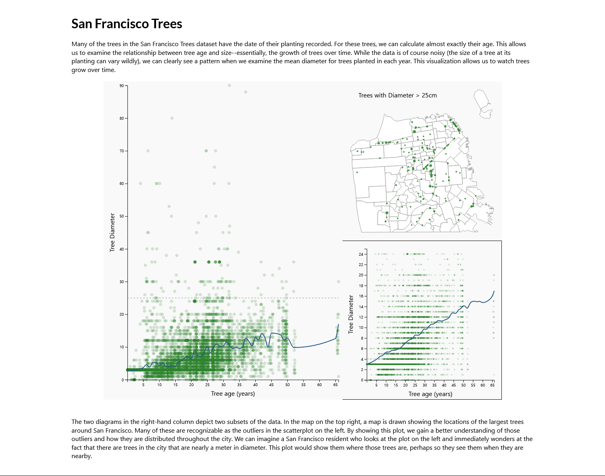

# Tree Growth Visualization
Sam Fuchs (scf73)

I've designed a simple, static visualization that uses the San Francisco trees
dataset to illustrate the growth of trees over time. In the process of
designing, building and iterating on this visualization, I've added and
subtracted elements to generate this final product.

## Basic Rationale

Many of the trees in the San Francisco Trees dataset have the date of their
planting recorded. For these trees, we can calculate almost exactly their age.
This allows us to examine the relationship between tree age and size. In a
sense, this represents the growth of trees over time. While the data is of
course noisy, we can clearly see a pattern when we examine the mean diameter for
trees planted in each year. This visualization allows us to watch trees grow
over time.

## Challenges

The largest concern with this design concept is that the planting date is not
recorded for all of the trees in the dataset. Because there is no way to assume
a planting date for these trees, I've chosen to exclude them from the
visualization, which means that this visualization only represents 9,300 trees
across San Francisco. This is, however, a significant number of trees, and makes
for a clear and visually appealing plot.

## Visual Elements

The major plot shows all of the trees with planting dates from the dataset,
organized like so: the x-axis uses the planting date of the tree to compute its
age in years from planting, and the y-axis represents the tree's diameter at
breast height. Although no unit is provided for the y-axis, I'm relatively
confident that the trees are measured in centimeters. Because the density of
these points makes the trend within the plot difficult to interpret unaided,
I've added a trendline which follows the mean diameter of trees planted in each
year. This trendline helps us to see how the tree diameter increases with time.

### Minimap

The two diagrams in the right-hand column depict two subsets of the data. In the
plot on the top right, a map is drawn showing the locations of the largest trees
around San Francisco. Many of these are immediately recognizable in the plot on
the left as outliers. By mapping the locations of these trees, we gain a better
understanding of those outliers and how they are distributed throughout the
city. We can imagine a San Francisco resident who looks at the plot on the left
and immediately wonders at the fact that there are trees in the city that are
nearly a meter in diameter. This plot would show them where those trees are,
perhaps so they see them when they are nearby.

### Inset Plot

The scatterplot on the lower right-hand side is similar to the plot on the left,
except that it examines the opposite subset of the data: the trees which are
less than 25cm in diameter. Because there are so many more of these trees, the
pattern of growth is more pronounced, particularly as major outliers are
removed. Additionally, I use a different line interpolation scheme, which
smoothes out peaks and valleys more aggressively, and, as a result, the
correlation between increasing age and increasing diameter is more obvious. This
plot is designed to more clearly depict how the dataset illustrates tree growth.
